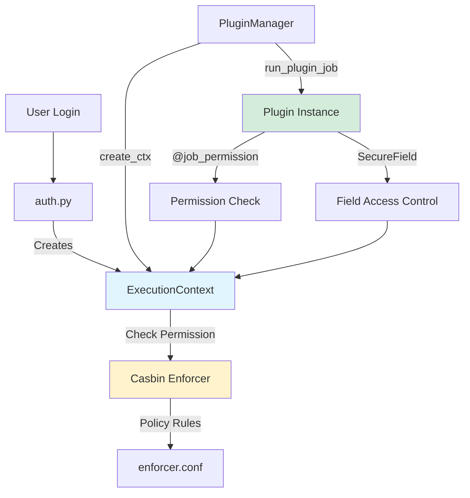
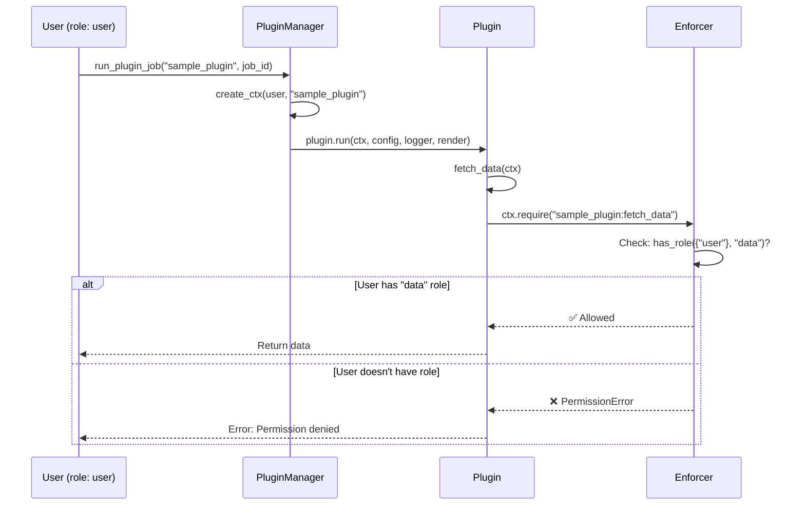

# Plugin Permission System - Comprehensive Guide

## 📋 Overview

The Job Scheduler uses a **Casbin RBAC** (Role-Based Access Control) permission system with:

- ✅ **Permission Decorators**: `@global_permission`, `@job_permission`
- ✅ **Execution Context**: Sandboxed user/package scope
- ✅ **Secure Fields**: Field-level permissions
- ✅ **Multi-version Plugins**: Plugin versioning with `@v0_1_0`, `@v0_2_0`
- ✅ **Template System**: Jinja2 with permission checks

---

## 🏗️ System Architecture



---

## 1️⃣ Core Components

### **1.1 User & Roles** ([auth.py](file:///Users/kelvin/Desktop/projects/job-scheduler/auth.py))

```python
@dataclass(frozen=True)
class User:
    id: int
    roles: frozenset[str]  # e.g., {"admin"}, {"user"}

# Hardcoded users
USERS = [
    UserData(User(1, frozenset({"admin"})), "thanhtu", "admin"),
    UserData(User(2, frozenset({"user"})), "cuongnv", "admin"),
]
```

**Two default roles:**

- `admin`: Full access to all permissions
- `user`: Only has `job` and `field` permissions

---

### **1.2 Why Use `frozen=True`?** 🔒

> [!IMPORTANT]
> **Security by Immutability** - Prevents mutation attacks in multi-threaded environments

#### **User dataclass with frozen=True**

```python
@dataclass(frozen=True)
class User:
    id: int
    roles: frozenset[str]  # frozenset is also immutable
```

**Reasons:**

1. **Thread Safety** 🧵

   ```python
   # ❌ Without frozen - Race condition can occur
   user = User(1, {"user"})

   # Thread 1: Checking permission
   if "admin" in user.roles:  # False
       # ...

   # Thread 2: Evil mutation (if not frozen)
   user.roles.add("admin")  # Changing roles mid-execution!

   # Thread 1: Continues with wrong assumption
   do_admin_stuff()  # 💥 Security breach!
   ```

2. **Prevent Privilege Escalation** 🛡️

   ```python
   # frozen=True prevents
   user.roles = frozenset({"admin"})  # ❌ FrozenInstanceError
   user.id = 999  # ❌ FrozenInstanceError
   ```

3. **Hash-able** (Can be used as dict key, set member)

   ```python
   # Can cache user permissions
   permission_cache: dict[User, set[str]] = {}
   permission_cache[user] = {"read", "write"}  # ✅ Works because frozen
   ```

4. **Predictable State** 📌
   ```python
   def check_permission(user: User):
       # user.roles guaranteed not to change
       # No need for defensive copy
       return "admin" in user.roles
   ```

**frozenset vs set:**

| Type        | Mutable | Hash-able | Thread-safe |
| ----------- | ------- | --------- | ----------- |
| `set`       | ✅      | ❌        | ❌          |
| `frozenset` | ❌      | ✅        | ✅          |

---

### **1.3 ExecutionContext** ([enforcer.py](file:///Users/kelvin/Desktop/projects/job-scheduler/enforcer.py#L39-L72))

**Immutable context** containing user and permission checker:

```python
class ExecutionContext:
    __slots__ = ("user", "package", "_allowed")

    user: User
    package: Optional[str]  # Plugin package name
    _allowed: Callable  # Permission checking function

    def allowed(self, permission: str) -> bool:
        """Check if user has permission"""
        return self._allowed(permission)

    def is_admin(self) -> bool:
        return "admin" in self.user.roles

    def require(self, permission: str):
        """Raise PermissionError if not allowed"""
        if not self.allowed(permission):
            raise PermissionError(f"Permission denied: {permission}")
```

#### **Immutability Implementation** 🔐

> [!IMPORTANT]
> ExecutionContext uses `__slots__` + custom `__setattr__` to enforce immutability

**1. `__slots__` - Memory optimization + Prevent dynamic attributes**

```python
__slots__ = ("user", "package", "_allowed")
```

**Benefits:**

- ❌ **Cannot add new attributes:** `ctx.new_field = x` → `AttributeError`
- ⚡ **Faster attribute access:** No `__dict__`, direct pointer
- 💾 **Memory efficient:** Saves ~40% memory per instance

**2. Custom `__setattr__` - Block mutation after init**

```python
def __setattr__(self, name, value):
    # 🔒 block mutation after initialization
    if name in self.__slots__ and hasattr(self, name):
        raise AttributeError("ExecutionContext is immutable")
    super().__setattr__(name, value)
```

**Prevents:**

```python
ctx = ExecutionContext(user, "plugin")

# ❌ Cannot mutate after init
ctx.user = another_user        # AttributeError: ExecutionContext is immutable
ctx.package = "evil_plugin"    # AttributeError: ExecutionContext is immutable
ctx._allowed = lambda x: True  # AttributeError: ExecutionContext is immutable
```

**3. Init with `object.__setattr__` - Bypass protection during construction**

```python
def __init__(self, user: User, package: Optional[str], enforce):
    object.__setattr__(self, "user", user)      # ✅ OK during init
    object.__setattr__(self, "package", package)

    def _allowed(permission: str):
        return True if enforce is None else enforce(user.id, permission, user.roles)

    object.__setattr__(self, "_allowed", _allowed)
```

**Why use `object.__setattr__`?**

- Custom `__setattr__` would block even init if using `self.x = y`
- `object.__setattr__()` bypasses custom logic, only used during init

**4. Closure to prevent \_allowed mutation**

```python
# Prevent closure access and modification later
def _allowed(permission: str, _call=enforce):
    return True if _call is None else _call(user.id, permission, user.roles)
```

**Why closure?**

- `_call=enforce` captures enforce **by value** at creation time
- Even if `enforce` variable changes later, closure still uses old value
- **Security:** Cannot modify permission logic after context is created

**Immutability Stack:**

```
┌────────────────────────────────────┐
│ frozen User (dataclass)            │ ← Immutable
├────────────────────────────────────┤
│ frozenset roles                    │ ← Immutable
├────────────────────────────────────┤
│ ExecutionContext (__slots__)       │ ← No dynamic attrs
├────────────────────────────────────┤
│ Custom __setattr__                 │ ← Block mutation
├────────────────────────────────────┤
│ Closure _allowed                   │ ← Captured enforce
└────────────────────────────────────┘
```

**Creating context:**

```python
# In PluginManager
ctx = PluginManager.create_ctx(user, package="sample_plugin")
# ctx.user, ctx.package, ctx._allowed cannot be changed anymore
```

---

### **1.4 Casbin Enforcer** ([enforcer.conf](file:///Users/kelvin/Desktop/projects/job-scheduler/enforcer.conf))

**Policy model (RBAC):**

```conf
[request_definition]
r = sub, obj, ctx

[policy_definition]
p = sub, obj

[matchers]
m = (has_role(r.ctx, p.sub)) && (p.obj == "*" || r.obj == p.obj)
```

**Default policies:**

```python
POLICIES = [
    ["admin", "*"],      # Admin has all permissions
    ["user", "job"],     # User has job permission
    ["user", "field"],   # User has field permission
]
```

**Runtime policies** (from plugin `roles()`):

```python
# Plugins can add additional policies
enforcer.add_policy("data", "sample_plugin:fetch_data")
```

---

## 2️⃣ Permission Types

### **2.1 Global Permissions** (`@global_permission`)

**Used for:** Functions **NOT specific to any plugin** (DAO methods, utils)

```python
from enforcer import global_permission, ExecutionContext

@global_permission("job")
def get_all_plugins(self, ctx: ExecutionContext):
    # ctx is auto-injected
    # Permission check: user must have "job" permission
    return session.query(Plugin).all()
```

**3 types of global permissions:**

- `plugin`: Manage plugins
- `job`: Manage jobs
- `field`: Manage value versions

**Auto-registration:**  
Functions with `@global_permission` are automatically registered in `GLOBAL_PERMISSION_REGISTRY` for use in Jinja2 templates.

---

### **2.2 Job Permissions** (`@job_permission`)

**Used for:** Functions **specific to a plugin** (plugin methods)

```python
from enforcer import job_permission, ExecutionContext

@job_permission("fetch_data")
def fetch_data(ctx: ExecutionContext):
    # Permission check: {package}:fetch_data
    # Example: "sample_plugin:fetch_data"
    return ctx.user
```

**Permission format:** `{package}:{permission_key}`

**Plugin roles mapping:**

```python
class Plugin:
    @classmethod
    @hookimpl
    def roles(cls):
        return {
            "fetch_data": {"data", "admin"},  # Roles with permission
            "code_read": {"admin"},
            "code_write": {"admin"},
        }
```

---

### **2.3 Secure Fields** (Field-level Permissions)

**Used for:** Config fields requiring separate permissions

```python
from plugins.schema import SecureBaseModel, SecureField

class Config(SecureBaseModel):
    js_template: str = SecureField(
        "",
        read="code_read",   # Only those with "code_read" can read
        write="code_write",  # Only those with "code_write" can write
        json_schema_extra=ui_schema({"ui:field": "Template"})
    )
```

**Auto permission checks:**

- `__getattr__`: Check `read` permission when accessing field
- `model_dump()`: Only include fields user has read permission for
- `model_json_schema()`: Only show fields in schema if user has permission
- `model_validate()`: Check `write` permission when updating

---

## 3️⃣ Plugin Development

### **3.1 Plugin Structure**

```
plugins/
├── sample_plugin/           # Base plugin
│   ├── plugin.py
│   └── data.py
├── sample_plugin@v0_1_0/   # Version 1
│   └── plugin.py
└── sample_plugin@v0_2_0/   # Version 2
    └── plugin.py
```

**Multi-version:** Folder names with `@version` are treated as versioned plugins.

---

### **3.2 Plugin Hooks**

```python
import pluggy
from enforcer import ExecutionContext

PROJECT_NAME = "job-scheduler"
hookimpl = pluggy.HookimplMarker(PROJECT_NAME)

class Plugin:
    @classmethod
    @hookimpl
    def install(cls) -> bool:
        """Called when plugin is installed"""
        return True

    @classmethod
    @hookimpl
    def env(cls) -> dict[str, Any]:
        """Provide globals for Jinja2 templates"""
        return {
            "datetime": datetime,
            "fetch_data": fetch_data,  # Functions
            "MyClass": MyClass,        # Classes
        }

    @classmethod
    @hookimpl
    def schema(cls, ctx: ExecutionContext):
        """Return JSON Schema with permission filtering"""
        return Config.model_json_schema(ctx)

    @classmethod
    @hookimpl
    def config(cls, ctx: ExecutionContext, json=None, validate=False):
        """Parse and validate config"""
        return Config.model_validate(ctx, json or {}, validate)

    @classmethod
    @hookimpl
    def roles(cls):
        """Define permission mappings"""
        return {
            "fetch_data": {"data", "admin"},
            "code_read": {"admin"},
        }

    @classmethod
    @hookimpl
    async def run(cls, ctx: ExecutionContext, config, logger, render):
        """Execute plugin logic"""
        # Sandbox execution with ctx
        logger.info("Running...")
        return True
```

---

### **3.3 Permission Flow Example**



---

## 4️⃣ Template System with Permissions

### **4.1 Jinja2 Template Rendering**

**Renderer auto-injects `ctx`:**

```python
# In plugin run()
version = render(
    ctx,  # ExecutionContext is injected
    "{{ dao.get_value_version(id).value }}",
    config.model_dump(),
    id=config.sql_id,
)
```

**Templates can call:**

- Global permission functions: `{{ dao.get_all_plugins(ctx) }}`
- Plugin env functions: `{{ fetch_data(ctx) }}`
- Permission checks automatically through decorators

---

### **4.2 UI Schema Expressions**

```python
Field(
    json_schema_extra=ui_schema({
        "ui:expr": (
            "{{ dao.get_value_versions(field_id, search, limit, offset) | tojson }}",
            ["field_id"]  # Dependencies
        )
    })
)
```

When rendering UI, expressions are evaluated with `ctx` and permissions are checked.

---

## 5️⃣ Best Practices

### ✅ DO

```python
# 1. Always use ExecutionContext
@job_permission("read_sensitive_data")
def get_secrets(ctx: ExecutionContext):
    ctx.require("premium")  # Extra check if needed
    return secrets

# 2. Use SecureField for sensitive data
class Config(SecureBaseModel):
    api_key: str = SecureField("", read="admin", write="admin")

# 3. Define clear roles mapping
def roles(cls):
    return {
        "read_data": {"user", "admin"},
        "write_data": {"admin"},
    }
```

### ❌ DON'T

```python
# ❌ Bypass permission checks
def get_secrets():  # No ctx parameter
    return secrets

# ❌ Manual permission checks (use decorator instead)
def fetch_data(ctx):
    if not ctx.allowed("fetch_data"):  # Decorator is better
        raise PermissionError()

# ❌ Hardcoded admin checks
def delete_all(ctx):
    if not ctx.is_admin():  # Use permission key instead
        raise PermissionError()
```

---

## 6️⃣ Common Patterns

### **Pattern 1: DAO Method with Global Permission**

```python
class DAO:
    @global_permission("job")
    def get_jobs_by_model_keys(
        self,
        ctx: ExecutionContext,  # Auto-injected
        model_keys: List[str]
    ) -> List[Job]:
        # Permission already checked
        return session.query(Job).filter(...)
```

### **Pattern 2: Plugin Function with Job Permission**

```python
@job_permission("fetch_external_data")
def fetch_from_api(ctx: ExecutionContext, url: str):
    # Permission: {package}:fetch_external_data
    response = httpx.get(url)
    return response.json()

class Plugin:
    _env = {"fetch_from_api": fetch_from_api}

    def roles(cls):
        return {"fetch_external_data": {"premium", "admin"}}
```

### **Pattern 3: Multi-level Security**

```python
class Config(SecureBaseModel):
    # Level 1: Field visibility
    secret_key: str = SecureField("", read="admin", write="admin")

    # Level 2: Function permission
    @job_permission("use_secret_key")
    def use_key(ctx: ExecutionContext, key: str):
        # Only "admin" and "premium" can call
        return encrypt_with_key(key)
```

---

## 7️⃣ Migration Notes

### **Old → New (JSON to Native Types)**

```python
# OLD: Config as JSON string
config: Mapped[str] = mapped_column(Text, nullable=True)
job_config = json.loads(job.config)

# NEW: Config as native JSON
config: Mapped[dict[str, Any] | None] = mapped_column(JSON, nullable=True)
job_config = job.config  # Direct access
```

### **Old → New (ACL Resolver Removed)**

```python
# OLD: ACL Resolver with global mapping
PluginManager.acl_resolver = ACLResolver(
    job_globals={"get_jobs": dao.get_jobs}
)

# NEW: Direct decorator usage
@global_permission("job")
def get_jobs(self, ctx: ExecutionContext):
    return session.query(Job).all()
```

---

## 🎯 Key Takeaways

| Concept                | Purpose                      | Usage                            |
| ---------------------- | ---------------------------- | -------------------------------- |
| **ExecutionContext**   | User/package scope container | `ctx.allowed()`, `ctx.require()` |
| **@global_permission** | System-level permissions     | DAO methods, utilities           |
| **@job_permission**    | Plugin-specific permissions  | Plugin functions                 |
| **SecureField**        | Field-level access control   | Sensitive config fields          |
| **roles()**            | Permission mapping           | Define who can access what       |
| **Multi-version**      | Plugin versioning            | `plugin@v0_1_0`, `@v0_2_0`       |
| **frozen=True**        | Immutability for security    | Prevent mutation attacks         |
| \***\*slots\*\***      | Memory + security            | Prevent dynamic attrs            |

---

## 📚 Related Files

- [enforcer.py](file:///Users/kelvin/Desktop/projects/job-scheduler/enforcer.py) - Core permission system
- [enforcer.conf](file:///Users/kelvin/Desktop/projects/job-scheduler/enforcer.conf) - Casbin config
- [auth.py](file:///Users/kelvin/Desktop/projects/job-scheduler/auth.py) - User authentication
- [plugin_manager.py](file:///Users/kelvin/Desktop/projects/job-scheduler/plugin_manager.py) - Plugin orchestration
- [plugins/schema.py](file:///Users/kelvin/Desktop/projects/job-scheduler/plugins/schema.py) - SecureBaseModel & SecureField
- [plugins/sample_plugin/plugin.py](file:///Users/kelvin/Desktop/projects/job-scheduler/plugins/sample_plugin/plugin.py) - Example implementation
- [models.py](file:///Users/kelvin/Desktop/projects/job-scheduler/models.py) - DAO with permissions
